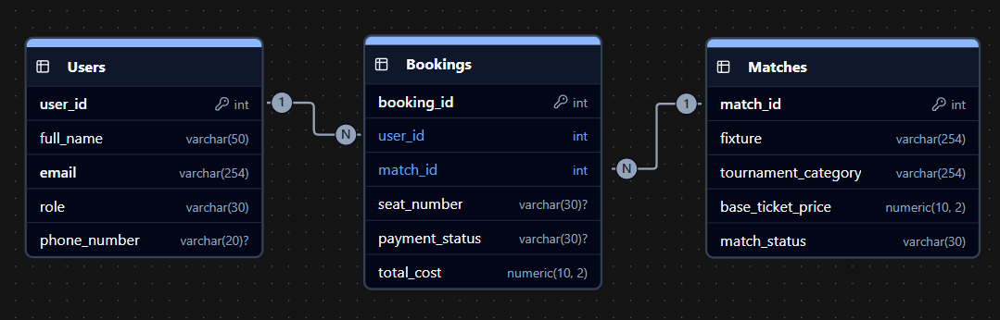
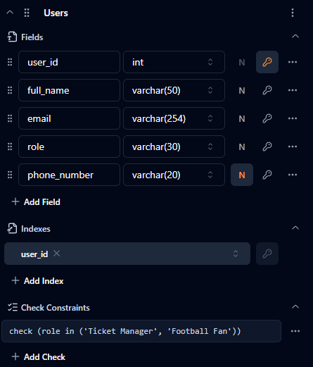
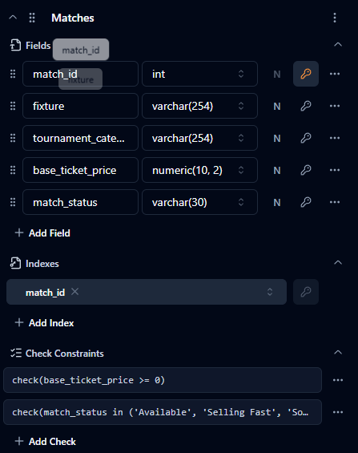
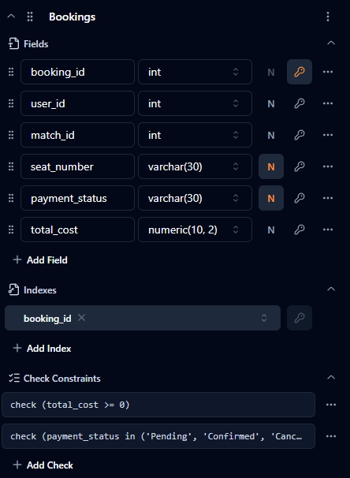

# Football Ticket Booking System

Here i have designed a database for a system called `Football Ticket Booking System`. I have also practiced some queries regarding to this `Football Ticket Booking System`'s database design.

## Table of content
- [Database Design](#database-design)
    - [Entities](#entities)
    - [Relationship Cardinality](#relationship-cardinality)
- [SQL Queries](#sql-queries)
    - [Table creation](#tables-creation)
    - [Practice Question Solution](#practice-question-solution)
- [ER Diagram](#er-diagram)
    - [ER Diagram using `ChartDB.io`](#er-diagram-using-chartdbio)

## Database Design

### Entities
- `Users`
- `Matches`
- `Bookings`

### Relationship Cardinality
- `Users (user_id)PK` (1) --< (N) `Bookings (user_id)FK`
- `Matches (match_id)PK` (1) --< (N) `Bookings (match_id)FK`

## SQL Queries

### Tables creation

- [`Users` table Creation](./QUERY.sql#L16-L27)
- [`Matches` table creation](./QUERY.sql#L31-L42)
- [`Bookings` table creation](./QUERY.sql#L46-L60)

### Practice Question Solution
1. [Query 1: Retrieve all upcoming football matches belonging to the 'Champions League' where the match status is 'Available'.](./QUERY.sql#L96-L97)

2. [Query 2: Search for all users whose full names start with 'Tanvir' or contain the phrase 'Haque' (case-insensitive).](./QUERY.sql#L99-L100)

3. [Query 3: Retrieve all booking records where the payment status is missing (`NULL`), replacing the empty result with 'Action Required'.](./QUERY.sql#L102-L103)

4. [Query 4: Retrieve match booking details along with the User's full name and the scheduled Match fixture teams.](./QUERY.sql#L105-L115)

5. [Query 5: Display a comprehensive list of all users and their booking IDs, ensuring that fans who have *never* bought a ticket are still listed.](./QUERY.sql#L117-L124)

6. [Query 6: Find all ticket bookings where the total cost is strictly higher than the average cost of all ticket bookings.](./QUERY.sql#L126-L134)

7. [Query 7: Retrieve the top 2 most expensive matches sorted by base ticket price, skipping the absolute highest premium match.](./QUERY.sql#L136-L143)

## ER Diagram

### ER Diagram using [ChartDB.io](https://chartdb.io)

#### ER Diagram

#### Users Table

#### Matches Table

#### Bookings Table

